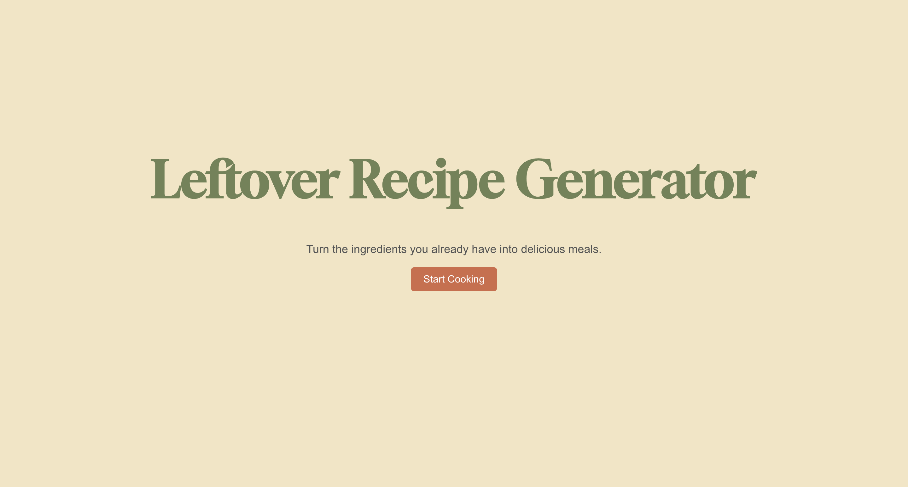
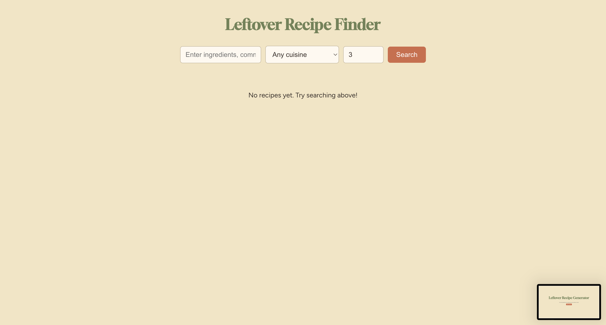
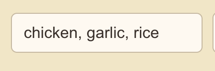
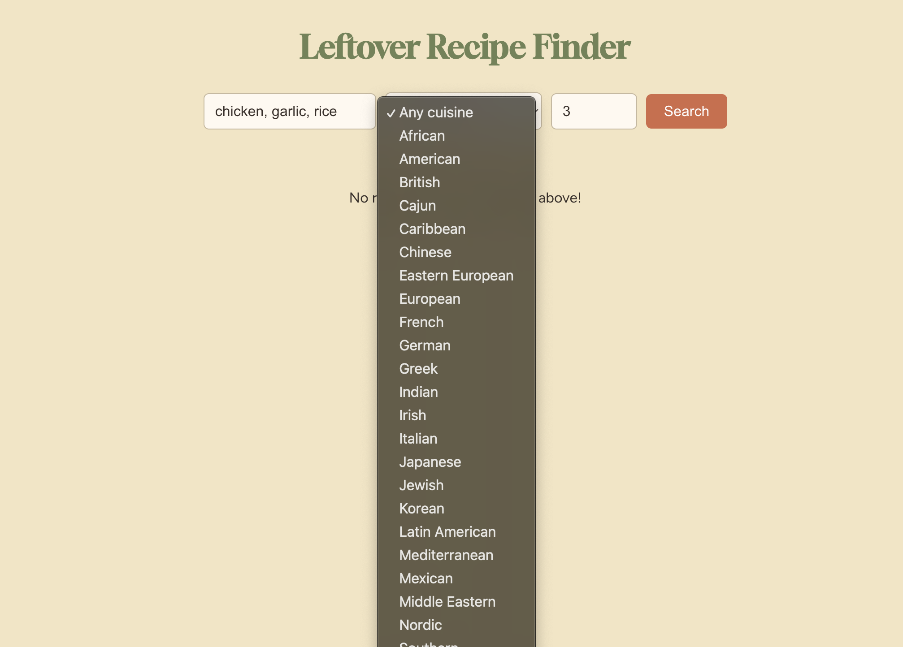
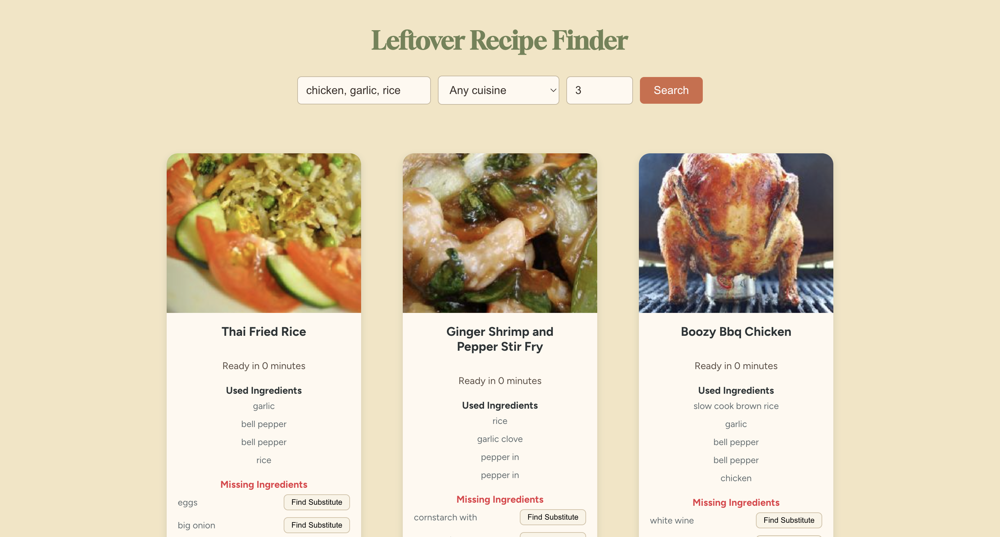

# Leftover Recipe Application  
## User Guide

---

## Overview

The **Leftover Recipe Application** helps users generate meal ideas using
ingredients they already have at home. By entering available ingredients,
users receive a ranked list of recipes that best match their input, helping
reduce food waste and simplify everyday cooking decisions.

This guide explains how to **run and use the application**.  
For architectural details, code walkthroughs, and implementation notes, see
the **Developer Guide**.

👉 [Developer Guide](./developer_guide.md)

---

## What the App Does

- Accepts a list of ingredients from the user
- Optionally filters recipes by cuisine type
- Ranks recipes based on ingredient overlap
- Automatically includes common pantry staples
- Displays recipes in a clean, card-based interface
- Provides ingredient substitution suggestions

---

## Tech Stack (High-Level)

- **Frontend:** React
- **Backend:** Node.js + Express
- **HTTP Client:** Axios
- **Environment Config:** dotenv
- **External API:** Spoonacular

No database or user accounts are required to run the application.

---

## Dependencies

### Backend Dependencies

The backend server (`server.js`) requires:

- **Node.js** (v16+ recommended)
- **express** – API server framework
- **axios** – HTTP requests to Spoonacular
- **cors** – Enables cross-origin requests
- **dotenv** – Loads environment variables from `.env`

Install backend dependencies from the project root:

```bash
npm install
```

---

### Frontend Dependencies

The frontend React app depends on:

* **react**
* **react-dom**
* **react-scripts**
* **react-router-dom**
* **axios**

Install frontend dependencies:

```bash
cd client
npm install
```

---

### External Services

* **Spoonacular API**

---

### How to Get a Spoonacular API Key

This application uses the Spoonacular Recipe API. Follow these steps to obtain an API key:

1. Visit the Spoonacular website:
   https://spoonacular.com/food-api

2. Create a free account (or log in if you already have one).

3. Navigate to your API Dashboard after logging in.

4. Copy your API key.

5. In the **project root** directory, create a file named `.env`.

---

### Environment Configuration

The backend server uses environment variables for API authentication and port
configuration.

Add the following contents to your `.env` file:

```text
API_KEY=your_spoonacular_api_key_here
PORT=5001
```

---

### Notes on Other Files

* Python is **not required** to run this project.
* Any Python files included in the repository are archived experimental tools and are not part of the active application.

---

## How to Run the Application

### Step 1: Clone the Repository

```bash
git clone <your-github-repo-url>
cd leftover-recipe-app
```

---

### Step 2: Set Up Environment Variables

Create a `.env` file in the project root with your Spoonacular API key:

API_KEY=your_spoonacular_api_key_here


---

### Step 3: Start the Backend Server

From the project root:

```bash
node server.js
```

You should see:

```text
Server is running on port 5001
```

---

### Step 4: Start the Frontend Application

Open a **new terminal window**:

```bash
cd client
npm start
```

The application will open at:

```
http://localhost:3000
```

---

## How to Use the App

### Home Page



* Click **Start Cooking** to begin


### Recipe Search Page



1. Enter ingredients separated by commas
   Example:
   ```
   chicken, garlic, rice
   ```



2. (Optional) Select a cuisine from the dropdown



3. Choose how many recipes to return (3–12)


4. Click **Search**


5. Recipes will appear as cards below the search bar.



6. To view substitutions click on **find substitute** (to close click **hide substitute**)

---

## Common Errors & Fixes

- **Recipes do not load**
  - Ensure the backend server is running on port 5001
  - Check that your `.env` file contains a valid API key
  - Make sure all of the dependencies are installed

- **API request errors**
  - Spoonacular API rate limits may temporarily block requests
  - Wait and try again later

---

## Known Limitations (User-Facing)

* Internet connection required
* Recipe availability depends on Spoonacular API
* API rate limits may restrict heavy usage
* Results reset when the server restarts
* Error feedback is minimal in the UI

---

## Project Structure (Simplified)

client/        # React frontend
server.js      # Express backend
docs/          # User and developer documentation
archive/       # Archived documents


---

## For Developers

For technical architecture, code walkthroughs, known issues, and future
enhancements, refer to the programmer documentation:

**[Developer Guide](./developer_guide.md)**
